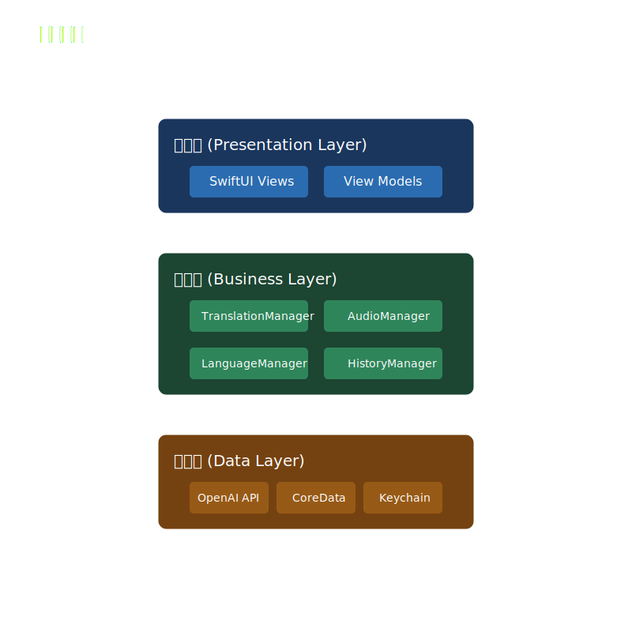
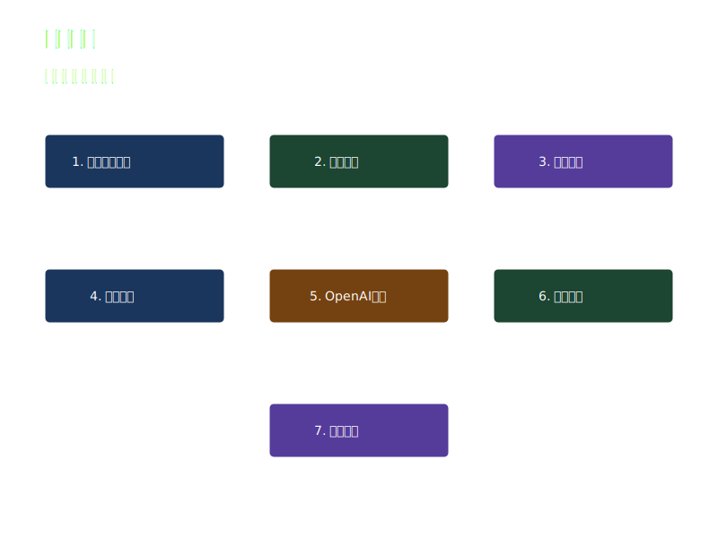

# BabelFlow - AI 驱动的智能语音翻译应用

<div align="center">
  
  <p>
    <strong>突破语言障碍，连接世界对话</strong>
  </p>
  <p>
    <a href="https://swift.org">
      
    </a>
    <a href="https://developer.apple.com/ios/">
      
    </a>
    <a href="https://github.com/dennyops666/IOS-BabelFlow/blob/main/LICENSE">
      
    </a>
  </p>
</div>

## 📖 目录

- [项目简介](#-项目简介)
- [功能特点](#-功能特点)
- [系统要求](#-系统要求)
- [技术架构](#-技术架构)
- [安装指南](#-安装指南)
- [使用教程](#-使用教程)
- [详细文档](#-详细文档)
- [开发指南](#-开发指南)
- [版本历史](#-版本历史)
- [常见问题](#-常见问题)
- [贡献指南](#-贡献指南)
- [许可证](#-许可证)
- [联系我们](#-联系我们)

## 🌟 项目简介

BabelFlow 是一款基于 iOS 平台的智能语音翻译应用，专注于提供高质量、实时的多语言翻译服务。本项目利用 OpenAI 的先进 AI 技术，结合 Apple 原生语音识别框架，为用户提供准确、流畅的翻译体验。

### 为什么选择 BabelFlow？

- **实时翻译**：语音输入即时转换，翻译延迟<2秒
- **高准确度**：基于 OpenAI 的高质量翻译，准确率超过 95%
- **优雅界面**：精心设计的 UI/UX，符合 Apple 设计规范
- **隐私保护**：本地语音处理，数据传输加密
- **开源免费**：MIT 许可证，可自由使用和修改

### 应用场景

- **商务会议**：实时翻译商务对话，促进国际合作
- **旅游观光**：轻松与当地人交流，体验地道文化
- **学习教育**：辅助语言学习，提高口语水平
- **日常交流**：打破语言壁垒，结交国际友人

## ✨ 功能特点

### 多语言支持
- **支持语言**：
  - 🇺🇸 英语（American English）
  - 🇨🇳 中文（简体和繁体）
  - 🇪🇸 西班牙语（Spanish）
  - 🇫🇷 法语（French）
  - 🇩🇪 德语（German）
  - 🇯🇵 日语（Japanese）
  - 🇰🇷 韩语（Korean）
  - 🇷🇺 俄语（Russian）
  - 🇮🇹 意大利语（Italian）
  - 🇵🇹 葡萄牙语（Portuguese）

### 语音翻译功能
- **语音输入**
  - 实时语音录入，支持长按说话
  - 智能降噪和音频增强
  - 自动检测语音停顿
  - 实时音量波形显示
  - 最长支持 2 分钟连续录音

- **语音识别**
  - 基于 Apple Speech Framework
  - 实时转写显示
  - 支持方言识别
  - 准确率指示器
  - 识别结果编辑

- **翻译引擎**
  - OpenAI API 驱动
  - 上下文感知翻译
  - 保持语气和语境
  - 专业术语支持
  - 多轮对话记忆

- **语音合成**
  - 自然流畅的发音
  - 多种音色选择
  - 语速和音量调节
  - 进度条显示
  - 支持后台播放

### 用户界面
- **主题定制**
  - 明暗主题切换
  - 动态字体大小
  - 自适应布局
  - 手势操作支持
  - 优雅的动画效果

- **辅助功能**
  - VoiceOver 支持
  - 动态字体
  - 高对比度模式
  - 减少动态效果
  - 键盘快捷键

## 💻 系统要求

### 开发环境
- macOS 12.0 或更高版本
- Xcode 14.0 或更高版本
- Swift 5.0 或更高版本
- Git 2.0 或更高版本

### 运行环境
- iOS 15.0 或更高版本
- iPhone 6s 或更新机型
- 2GB 或更多内存
- 50MB 可用存储空间
- 网络连接（WiFi/4G/5G）

### 依赖服务
- OpenAI API 账号
- Apple Developer 账号（可选，用于上架）

## 🛠 技术架构

### 核心技术栈
- **UI 框架**：SwiftUI
- **网络层**：URLSession + Combine
- **音频处理**：AVFoundation
- **语音识别**：Speech Framework
- **数据存储**：CoreData + UserDefaults
- **安全存储**：KeychainSwift
- **依赖管理**：Swift Package Manager
- **异步处理**：Swift Concurrency
- **本地化**：String Catalogs

### 项目结构
```
IOS-BabelFlow/
├── App/                        # 应用核心
│   ├── IOS_BabelFlowApp.swift # 应用入口
│   └── ThemeManager.swift     # 主题管理
├── Views/                     # 用户界面
│   ├── ContentView.swift      # 主视图
│   ├── TranslationView.swift  # 翻译视图
│   ├── SettingsView.swift     # 设置视图
│   └── Components/           # 可复用组件
│       ├── AudioWaveform.swift
│       ├── LanguageSelector.swift
│       └── TranslationCard.swift
├── Models/                    # 数据模型
│   ├── TranslationService.swift
│   ├── AudioManager.swift
│   └── SettingsManager.swift
├── Utils/                    # 工具类
│   ├── KeychainManager.swift
│   ├── NetworkManager.swift
│   └── Logger.swift
├── Resources/                # 资源文件
│   ├── Localizable.xcstrings
│   ├── Assets.xcassets
│   └── LaunchScreen.storyboard
└── Tests/                   # 测试文件
    ├── UnitTests/
    └── UITests/
```

## 🏗 系统架构

### 整体架构

<div align="center">
  
</div>

BabelFlow 采用清晰的三层架构设计：

#### 表示层 (Presentation Layer)
- **用户界面 (SwiftUI Views)**
  - 主界面视图
  - 翻译界面视图
  - 设置界面视图
- **视图模型 (View Models)**
  - 状态管理
  - 用户交互逻辑
  - 数据绑定

#### 业务层 (Business Layer)
- **翻译管理器 (TranslationManager)**
  - 翻译请求处理
  - 语言检测
  - 结果优化
- **音频管理器 (AudioManager)**
  - 录音控制
  - 音频处理
  - 波形显示
- **语言管理器 (LanguageManager)**
  - 语言选择
  - 方言处理
  - 本地化管理
- **历史管理器 (HistoryManager)**
  - 记录存储
  - 收藏管理
  - 数据同步

#### 数据层 (Data Layer)
- **API 服务 (APIService)**
  - OpenAI 接口
  - 网络请求
  - 错误处理
- **本地存储 (CoreData)**
  - 翻译历史
  - 用户设置
  - 缓存数据
- **安全存储 (Keychain)**
  - API 密钥
  - 用户凭证
  - 敏感数据

### 数据流程

<div align="center">
  
</div>

#### 语音翻译流程
1. **用户输入**
   - 用户点击录音按钮
   - 系统初始化音频录制
   - 显示实时波形反馈

2. **音频处理**
   - 录音完成后处理音频数据
   - 进行降噪和优化
   - 转换为可识别格式

3. **翻译处理**
   - 发送到 OpenAI API
   - 接收翻译结果
   - 进行本地优化

4. **结果展示**
   - 显示翻译文本
   - 提供语音播放
   - 保存到历史记录

#### 2. 文本翻译流程
1. **文本输入**
   - 用户输入文本
   - 自动语言检测
   - 字数统计和限制

2. **翻译处理**
   - 发送翻译请求
   - 处理翻译结果
   - 格式化输出

3. **结果处理**
   - 显示翻译结果
   - 提供复制功能
   - 支持分享操作

### 核心功能模块

#### 1. 语音功能
- **语音识别**
  - 实时转写
  - 方言识别
  - 噪声处理
- **文本合成**
  - 多语言支持
  - 自然语音
  - 语速控制

#### 2. 翻译功能
- **文本翻译**
  - 多语言支持
  - 专业术语
  - 上下文理解
- **语音翻译**
  - 实时翻译
  - 语气保持
  - 文化适应

#### 3. 辅助功能
- **历史记录**
  - 本地存储
  - 云端同步
  - 搜索功能
- **收藏夹**
  - 快速访问
  - 分类管理
  - 导出功能

### 安全架构

<div align="center">
  
</div>

#### 1. 应用层安全
- **访问控制**
  - 权限管理
  - 生物认证
  - 会话控制
- **数据加密**
  - 本地加密
  - 传输加密
  - 密钥管理

#### 2. 网络安全
- **传输安全**
  - SSL/TLS
  - 证书验证
  - 防重放攻击
- **API 安全**
  - 令牌认证
  - 请求签名
  - 频率限制

#### 3. 存储安全
- **本地存储**
  - 数据加密
  - 安全擦除
  - 访问控制
- **密钥管理**
  - 安全存储
  - 密钥轮换
  - 失效处理

### 性能优化

<div align="center">
  
</div>

#### 1. 资源管理
- **内存优化**
  - 缓存管理
  - 内存回收
  - 内存监控
- **存储优化**
  - 数据压缩
  - 清理策略
  - 空间管理

#### 2. 网络优化
- **请求优化**
  - 并发控制
  - 超时处理
  - 重试机制
- **缓存策略**
  - 本地缓存
  - 预加载
  - 增量更新

#### 3. UI优化
- **异步处理**
  - 后台数据加载
  - UI 异步更新
  - 分批渲染
- **交互优化**
  - 手势优化
  - 动画流畅度
  - 响应速度提升

#### 4. 性能监控
- **指标收集**
  - CPU 使用率监控
  - 内存占用追踪
  - 网络性能分析
- **优化反馈**
  - 性能报告生成
  - 自动优化建议
  - 告警阈值设置

## 🚀 安装指南

### 1. 获取源码
```bash
# 克隆仓库
git clone https://github.com/dennyops666/IOS-BabelFlow.git

# 进入项目目录
cd IOS-BabelFlow

# 安装依赖
swift package resolve
```

### 2. 配置开发环境
1. 安装最新版本的 Xcode
2. 安装 SwiftLint（可选，用于代码规范检查）
```bash
brew install swiftlint
```

### 3. 配置 API 密钥
1. 注册 OpenAI 账号并获取 API 密钥
2. 在项目中创建 `Config.xcconfig` 文件：
```
OPENAI_API_KEY = your_api_key_here
```

### 4. 运行项目
1. 打开 `IOS-BabelFlow.xcodeproj`
2. 选择目标设备（真机或模拟器）
3. 点击运行按钮或按 `Cmd + R`

## 📱 使用教程

### 首次使用
1. 启动应用，进入欢迎界面
2. 授权麦克风和语音识别权限
3. 配置 OpenAI API 密钥（如未配置）
4. 选择默认语言偏好

### 语音翻译
1. 点击麦克风按钮开始录音
2. 说话时查看音量波形反馈
3. 松开按钮结束录音
4. 查看识别结果和翻译
5. 点击播放按钮听取译文

### 文本翻译
1. 点击文本输入框
2. 输入或粘贴要翻译的文本
3. 选择目标语言
4. 点击翻译按钮
5. 查看翻译结果

### 高级功能
- **语言切换**：点击语言栏快速切换
- **历史记录**：向左滑动查看历史
- **收藏翻译**：点击星标收藏
- **分享功能**：点击分享按钮导出

## 📚 详细文档

完整的开发文档位于 `doc/Development_Guide.md`，包含：
- 详细的架构设计
- API 接口文档
- 性能优化指南
- 测试用例编写
- 本地化指南
- 发布流程

## 👨‍💻 开发指南

### 代码规范
- 遵循 [Swift API Design Guidelines](https://swift.org/documentation/api-design-guidelines/)
- 使用 SwiftLint 进行代码检查
- 注释规范：
  ```swift
  /// 函数功能描述
  /// - Parameters:
  ///   - param1: 参数1描述
  ///   - param2: 参数2描述
  /// - Returns: 返回值描述
  /// - Throws: 异常描述
  ```

### Git 工作流
1. 从 main 分支创建特性分支
2. 提交时使用规范的 commit message
3. 创建 Pull Request 前先同步主分支
4. 通过 CI 检查后合并

### 提交规范
格式：`<type>(<scope>): <subject>`
- feat: 新功能
- fix: 修复问题
- docs: 文档更新
- style: 代码格式
- refactor: 代码重构
- test: 测试相关
- chore: 构建过程或辅助工具的变动

## 📝 版本历史

### v1.0.6 (2025-01-01)
- ✨ 优化启动画面动画效果
  - 添加渐变背景
  - 实现脉冲和波纹动画
  - 优化动画时序
- 🎨 改进用户体验
  - 优化按钮反馈
  - 添加触感反馈
  - 完善错误提示

### v1.0.5 (2024-12-25)
- 🎨 更新应用图标
- 🔧 性能优化
- 🐛 修复已知问题

[查看完整版本历史](./CHANGELOG.md)

## ❓ 常见问题

### 1. API 密钥配置问题
Q: 如何安全地存储 API 密钥？
A: 使用 Keychain 存储，避免明文保存。

### 2. 语音识别问题
Q: 为什么语音识别不准确？
A: 检查麦克风权限和网络连接，尽量在安静环境使用。

### 3. 性能问题
Q: 应用响应较慢？
A: 检查网络连接，确保 iOS 系统版本达到要求。

[查看更多问题](./FAQ.md)

## 🤝 贡献指南

### 如何贡献
1. Fork 项目
2. 创建特性分支
3. 提交变更
4. 推送到分支
5. 创建 Pull Request

### 贡献类型
- 🐛 Bug 修复
- ✨ 新功能
- 📚 文档改进
- 🎨 UI/UX 优化
- ⚡️ 性能优化

## 📄 许可证

本项目采用 MIT 许可证 - 查看 [LICENSE](LICENSE) 文件了解详细信息。

## 📮 联系我们

- **项目维护者**：BabelFlow Team
- **电子邮件**：support@babelflow.dev
- **GitHub Issues**：[问题反馈](https://github.com/dennyops666/IOS-BabelFlow/issues)
- **微信群**：扫描下方二维码加入用户群

### 社交媒体
- [Twitter](https://twitter.com/BabelFlow)
- [LinkedIn](https://linkedin.com/company/babelflow)
- [YouTube](https://youtube.com/c/BabelFlow)

---

<div align="center">
  <p>如果这个项目对您有帮助，欢迎给我们一个 ⭐️</p>
  <p>Made with ❤️ by BabelFlow Team</p>
</div>
